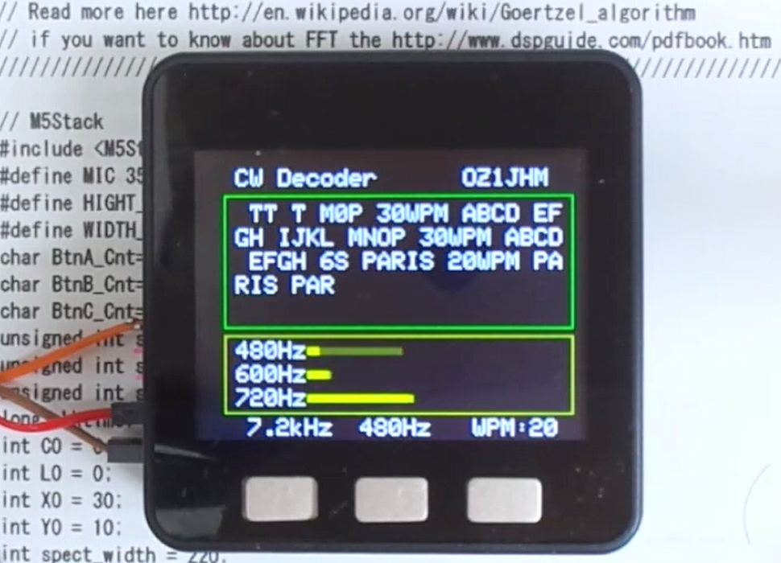

# M5Stack_CW_Decoder

 This program is based on [the code ‘CW Decoder made by Hjalmar Skovholm Hansen OZ1JHM VER 1.01’](http://oz1jhm.dk/content/very-simpel-cw-decoder-easy-build) and is designed to work with the M5Stack.

 Inputs can be MEMS Microphones (e.g. SPU0409HD5H-PB or SPU0414HR5H) instead of speakers.
  

